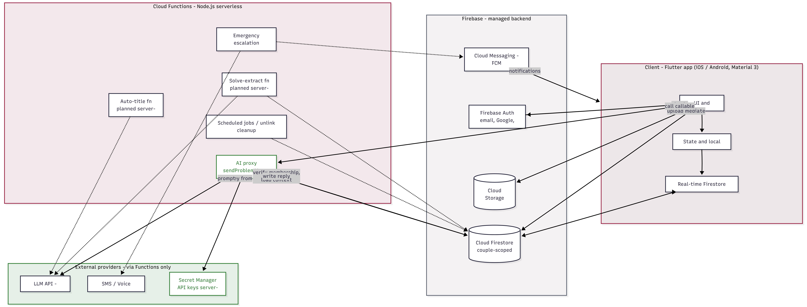
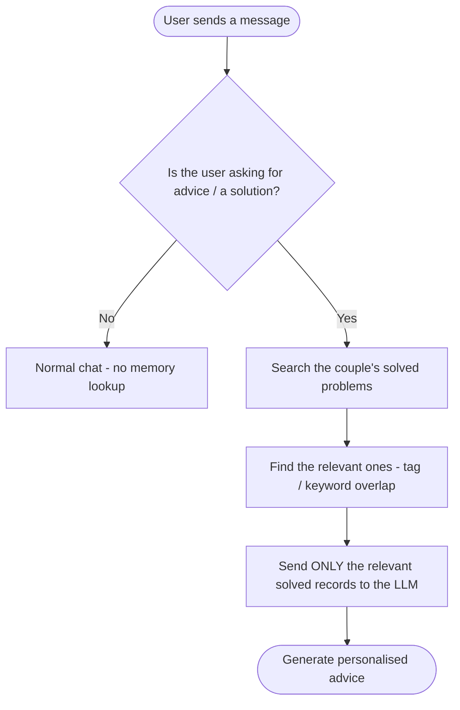

<!-- Replace the line below with your logo, e.g.:
      -->
<p align="center">
  <!-- LOGO PLACEHOLDER -->
  
</p>

<h1 align="center">CoupleCore</h1>

<p align="center">
  <em>A private, two-person relationship &amp; emotional-wellbeing companion.</em>
</p>

<p align="center">
  
  
  
  
</p>

---

## Overview

**CoupleCore** links exactly two people into a couple and helps them strengthen
communication, understand each other's emotions, avoid misunderstandings, and
coordinate shared relationship activities.

Privacy between the two partners is a core, non-negotiable value: data is
partitioned per couple, sensitive fields are encrypted, and the app deliberately
exposes **no presence signals** — no online status, "last seen," typing, or read
receipts.

The flagship feature is the **Problem Solver** — an AI relationship counsellor that
lets a couple talk through a problem, then distils each resolved issue into a
structured, searchable record the AI can draw on later.

---

## Table of Contents

- [Features](#features)
- [Architecture](#architecture)
- [Data Model](#data-model)
- [The Problem Solver (AI)](#the-problem-solver-ai)
- [Getting Started](#getting-started)
- [Configuration &amp; Secrets](#configuration--secrets)
- [Roadmap](#roadmap)
- [Privacy &amp; Safety](#privacy--safety)

---

## Features

Status legend: ✅ Implemented · 🟡 Partial · ⬜ Planned

| Area | Feature | Status |
|---|---|:---:|
| **Auth** | Email/password sign-in, AuthGate routing | ✅ |
| | Google / Apple sign-in, password reset | 🟡 |
| **Partner Linking** | Link two users into a couple | 🟡 |
| | Invite codes, mutual confirmation, unlink cleanup | ⬜ |
| **Mood Tracker** | Log mood; both partners' moods shown live | ✅ |
| | Daily reminder, private history &amp; trends | ⬜ |
| **Problem Solver (AI)** | AI-counsellor chat, persisted per-message | ✅ |
| | Mark Solved → structured record → chat deleted | ✅ |
| | Normal-chat eviction (keep newest 5) | ✅ |
| | Star to keep, chats list | ✅ |
| | Auto-titles (moving server-side) | 🟡 |
| | Solved-memory retrieval (keyword-gated, relevance search) | ⬜ |
| **Emergency Alert** | Send alert to partner | ✅ |
| | Location, full escalation (push → SMS → call) | ⬜ |
| **Shared Calendar** | Events &amp; reminders | ⬜ |
| **Menses Reminder** | Cycle prediction, shared/private visibility | ⬜ |
| **Memories** | Photos, videos, notes timeline | ⬜ |
| **Messaging** | Private couple chat, love notes | ⬜ |
| **Good Deeds** | Partner-confirmed deeds &amp; points | ⬜ |

---

## Architecture

CoupleCore uses a **client + serverless** architecture. The Flutter app talks
directly to Firebase for identity, data, media, and push, and delegates anything
needing a secret key or cross-user coordination (AI calls, emergency escalation,
scheduled jobs) to **Cloud Functions**. External providers (the LLM, telephony)
are reached **only** through Functions — keys never ship in the client.

<p align="center">
  <!-- Architecture diagram (PNG generated for the SRS) -->
  
</p>

| Layer | Component | Responsibility |
|---|---|---|
| Client | Flutter (Dart, Material 3) | UI, state, local cache, real-time listeners |
| Identity | Firebase Auth | Email/password, Google, Apple sign-in |
| Data | Cloud Firestore | Couple-scoped documents with security rules |
| Media | Cloud Storage | Photos / videos for Memories |
| Push | Cloud Messaging (FCM) | Reminders, gentle nudges, emergency delivery |
| Serverless | Cloud Functions (Node.js) | AI proxy, emergency escalation, scheduled jobs |
| AI | LLM API (Gemini, via Function) | Problem-solving replies &amp; summaries |
| Secrets | Secret Manager | API keys held server-side (never in client) |

---

## Data Model

Data is partitioned into three privacy scopes so security rules are enforced by
structure, not convention:

| Scope | Location | Who can access |
|---|---|---|
| Account | `users/{uid}` | The owner (profile, settings, link state) |
| Private | `users/{uid}/private/**` | The owner only (encrypted) |
| Shared | `couples/{coupleId}/**` | Only the two members in `memberUids` |

**Problem Solver collections**

```
couples/{coupleId}/problemSessions/{id}
    status: active | solved
    title, lastMessage, starred?, createdAt, updatedAt
    └── messages/{id}   role, content, sender, createdAt

couples/{coupleId}/solvedProblems/{id}
    problem, solution, impact, sourceTitle, tags[], createdAt
```

When a chat is solved, its structured record is written to `solvedProblems` and the
raw `problemSession` (with its messages) is deleted — so transcripts are not
retained, only the distilled record.

---

## The Problem Solver (AI)

The couple's flagship feature. Flow:

1. **Chat** — one active AI-counsellor conversation per couple; messages persist in
   real time and survive logout/app close.
2. **Mark Solved** — the AI extracts a structured record (**problem, solution,
   impact, tags**) from the chat and shows it for confirmation.
3. **Save &amp; clean up** — on confirm, the record is written to `solvedProblems`,
   then the raw chat is deleted. Deletion only runs *after* the save is verified, so
   no insight is ever lost.
4. **Keep it lean** — unsolved, unstarred chats are capped at the newest 5 (older
   ones auto-evict with their messages); **starred** chats are kept forever.
5. **Memory (planned)** — when a user asks for advice, the AI searches the couple's
   solved history and includes **only the relevant** records as context.

**Solved-memory retrieval logic (planned — FR-48f):**



---

## Getting Started

### Prerequisites

- [Flutter SDK](https://docs.flutter.dev/get-started/install) (stable channel)
- A [Firebase](https://console.firebase.google.com/) project
- [Node.js](https://nodejs.org/) 20+ (for Cloud Functions)
- The Firebase CLI: `npm install -g firebase-tools`

### Run the app

```bash
# 1. Clone
git clone https://github.com/<your-org>/couple_core.git
cd couple_core

# 2. Install dependencies
flutter pub get

# 3. Add your Firebase config
#    (google-services.json / GoogleService-Info.plist via flutterfire configure)
flutterfire configure

# 4. Create your local secrets file (gitignored)
cp lib/core/secrets.example.dart lib/core/secrets.dart
#    then add your keys where indicated

# 5. Run
flutter run
```

### Deploy Cloud Functions

```bash
cd functions
npm install

# Set the LLM key in Secret Manager (never in client code)
firebase functions:secrets:set GEMINI_API_KEY

# Deploy
firebase deploy --only functions
```

> Deploying Functions requires the Firebase **Blaze** plan (pay-as-you-go).
> Typical development usage stays within the free allowance.

---

## Configuration &amp; Secrets

- **Client secrets** live in `lib/core/secrets.dart`, which is **gitignored**. Copy
  `secrets.example.dart` and fill in your values — never commit real keys.
- **Server secrets** (the LLM API key) live in **Secret Manager**, injected into
  Cloud Functions at runtime. No API key should ever be bundled into the client.
- If a key is ever exposed, **rotate it** in the provider console immediately.

---

## Roadmap

- [ ] Finish moving all AI calls server-side (solve-extract, auto-title) — no key in client
- [ ] Implement solved-memory retrieval (FR-48f: keyword gate + relevance search)
- [ ] Partner linking: invite codes + mutual confirmation + unlink cleanup
- [ ] Emergency escalation: location + push → SMS → voice call
- [ ] Shared calendar, memories, messaging, good deeds
- [ ] Menses reminder module (shared/private)
- [ ] Notifications &amp; reminders via FCM
- [ ] Social sign-in (Google / Apple) + password reset

---

## Privacy &amp; Safety

- **No presence disclosure** — no online status, "last seen," typing, or read
  receipts anywhere in the app, by design.
- **Couple-scoped access** — Firestore security rules restrict shared data to the
  two members; private data to its owner; sensitive fields are encrypted.
- **Minimal AI context** — only the relevant, need-to-know context is sent to the
  LLM, through a server-side function.
- **Not a substitute for emergency services** — the emergency feature is a private
  signal to the partner and points users to local emergency services.

---

<p align="center"><sub>CoupleCore · built with Flutter &amp; Firebase</sub></p>